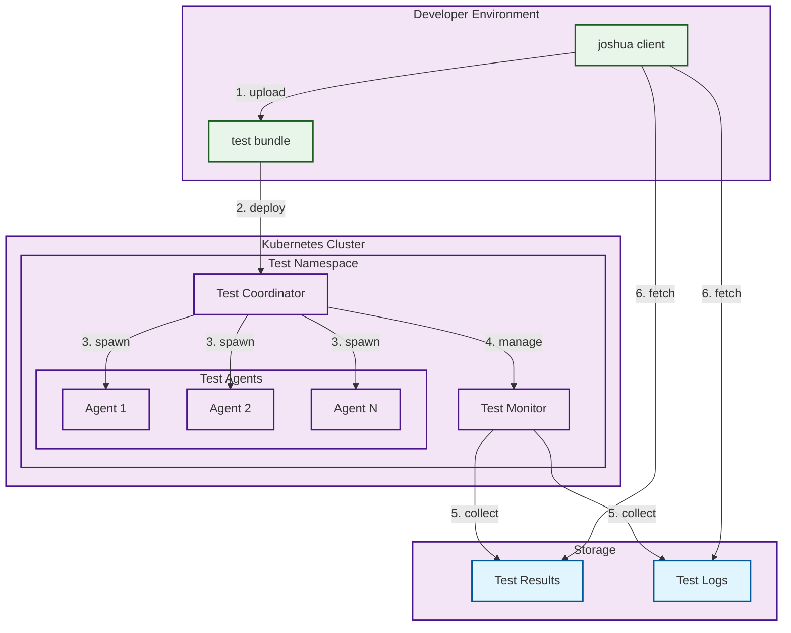
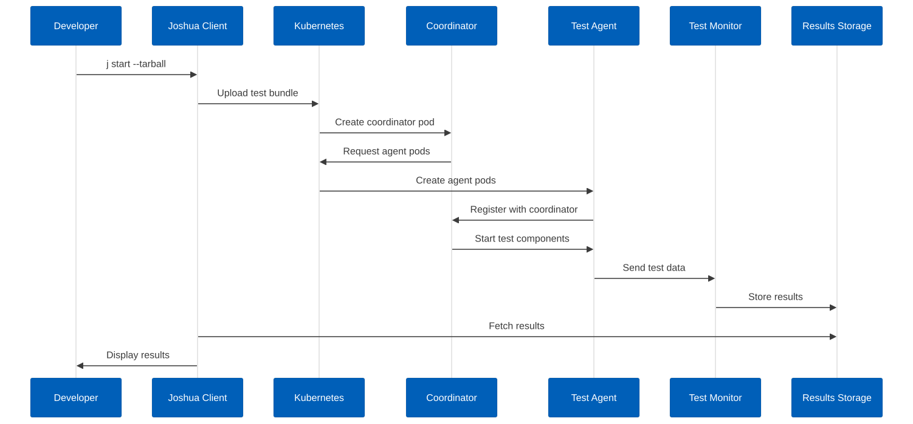
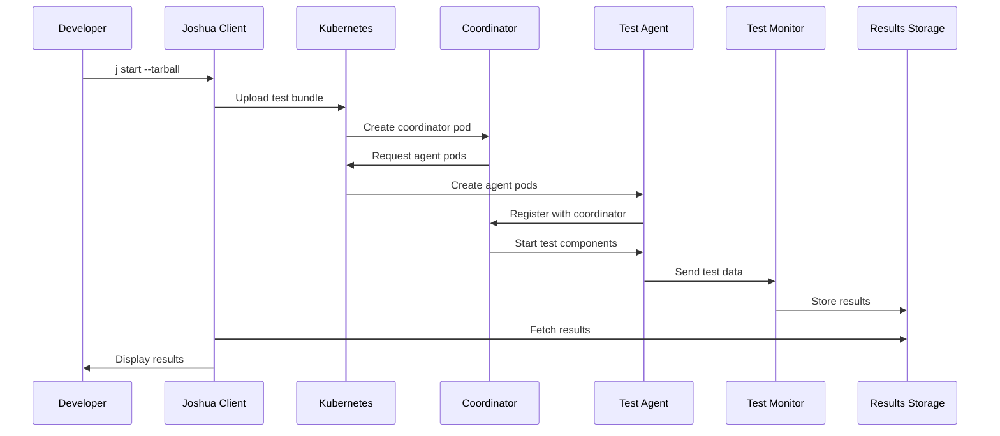
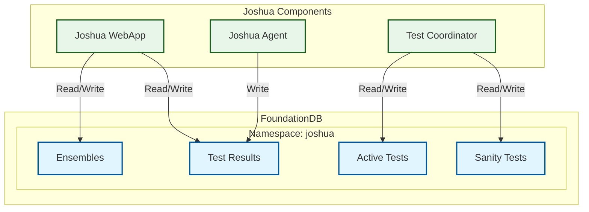

# Joshua Test Framework Guide

## What is Joshua?

Joshua is FoundationDB's distributed test framework that enables running correctness and simulation tests across multiple machines. It's designed to help developers test FoundationDB's behavior under various conditions and configurations.

The Joshua tooling is maintained in the [fdb-joshua repository](https://github.com/FoundationDB/fdb-joshua). This repository contains the client tools and infrastructure needed to interact with the Joshua test framework.

## Architecture

Joshua uses a distributed architecture to run tests across multiple machines:

1. **Kubernetes Cluster**
   - Joshua runs on a dedicated Kubernetes cluster
   - The cluster is configured to run Joshua agents as pods
   - Each test run can spawn multiple agents to simulate different components

2. **Test Execution Flow**
   - When you run a test (e.g., `j start`), the Joshua client:
     1. Uploads the test bundle to the cluster
     2. Creates a test coordinator pod
     3. The coordinator spawns agent pods as needed
     4. Agents execute the test components (e.g., fdbserver processes)
     5. Results are collected and stored in the working directory

3. **Agent Types**
   - **Test Agents**: Run the actual test components
   - **Coordinator**: Manages the test execution and agent lifecycle
   - **Monitor**: Collects and aggregates test results

4. **Resource Management**
   - Each test run gets its own namespace in the cluster
   - Resources are automatically cleaned up after test completion
   - Failed tests can leave resources behind (use `j delete` to clean up)

### Architecture Diagram



<details>
<summary>Click to view diagram source</summary>


</details>

### Component Interaction Diagram



<details>
<summary>Click to view diagram source</summary>


</details>

## FoundationDB Integration

Joshua uses FoundationDB (FDB) as its primary database for storing test results and managing test state. The integration is built into the core of Joshua's architecture.

### FDB Configuration

1. **Version**
   - Joshua uses FoundationDB version 6.3.18
   - The FDB API version is set to 630

2. **Connection Settings**
   - Cluster file location: Set via `JOSHUA_FDB_CLUSTER_FILE` environment variable
   - Default: `fdb.cluster` in the current directory
   - Namespace: Set via `JOSHUA_NAMESPACE` environment variable
   - Default: `joshua`

3. **Data Organization**
   - Test results are stored in FDB under the configured namespace
   - Results are organized by ensemble ID and test run
   - Each test run includes:
     - Test output
     - Return codes
     - Duration
     - Pass/fail status

### FDB Architecture Diagram



<details>
<summary>Click to view diagram source</summary>


</details>

### FDB Setup

1. **Installation**
   ```bash
   # Install FoundationDB client
   wget https://github.com/apple/foundationdb/releases/download/6.3.18/foundationdb-clients_6.3.18-1_amd64.deb
   sudo dpkg -i foundationdb-clients_6.3.18-1_amd64.deb

   # Install FoundationDB server
   wget https://github.com/apple/foundationdb/releases/download/6.3.18/foundationdb-server_6.3.18-1_amd64.deb
   sudo dpkg -i foundationdb-server_6.3.18-1_amd64.deb
   ```

2. **Configuration**
   - Create a cluster file (fdb.cluster) with your FDB connection string
   - Set environment variables:
     ```bash
     export JOSHUA_FDB_CLUSTER_FILE=/path/to/fdb.cluster
     export JOSHUA_NAMESPACE=joshua
     ```

3. **Kubernetes Integration**
   - The FDB cluster file is mounted as a ConfigMap in Kubernetes
   - Both the agent-scaler and joshua-agent containers have access to FDB
   - The cluster file is mounted at `/etc/foundationdb/fdb.cluster`

### FDB Data Management

1. **Test Results**
   - Results are stored in FDB under the `results` directory
   - Organized by pass/fail status and test type
   - Includes compressed output for large test runs

2. **Ensemble Management**
   - Active tests are tracked in the `active` directory
   - Sanity tests have a separate `sanity` directory
   - All ensembles are listed in the `all` directory

3. **Data Cleanup**
   - Use `j delete` to remove test data from FDB
   - The `j deleterange` command can clean up multiple tests
   - Failed tests are automatically marked in FDB

## Setup and Configuration

### Installation

The Joshua client tools are automatically installed in the FoundationDB development environment. The `j` command is an alias for `joshua` that's set up in the development container's `.bashrc`.

### Environment Setup

1. **Working Directory**
   - Default location: `/var/joshua/ensembles`
   - This is where test data and results are stored
   - The directory is automatically created and configured in the development environment

2. **Environment Variables**
   - `JOSHUA_USER`: Set in okteto.yml for running multiple jobs
     - Allows running multiple Joshua jobs simultaneously
     - Example: `JOSHUA_USER=mengxu${MYUSER}`

3. **Convenience Aliases**
   The development environment includes several useful aliases:
   ```bash
   # Main Joshua command alias
   alias j='joshua'
   
   # Start with latest correctness bundle
   alias jsd='j start --tarball $(find /root/build_output/packages -name correctness\*.tar.gz) "${@}"'
   
   # Custom test bundle creation
   function cbundle() {
       BUILD=~/build_output
       package=$1
       output_dir=$BUILD/rebundled_correctness/
       output=$output_dir/$(basename $package)
       echo "Bundle: $package"
       echo "Selected Tests: $2"
       rm -rf $output_dir
       mkdir -p $output_dir
       tar xvf $1 -C $output_dir
       shift
       tar -C $output_dir -czf $output bin/ joshua_test joshua_timeout $@
       cp -f $output .
       rm -rf $output_dir
       echo "Output Package: $(pwd)/$(basename $output)"
   }
   ```

## Basic Commands

### Starting Tests
```bash
# Start a test with a specific correctness bundle
j start --tarball build_output/packages/correctness-6.3.11.tar.gz

# Start with the latest correctness bundle (convenience alias)
jsd
```

### Managing Tests
```bash
# List all running tests
j list

# List stopped tests
j list --stopped

# View test logs
j tail <test_id>

# Check test failures
j failures <test_id>

# Stop a running test
j stop <test_id>

# Delete a test
j delete <test_id>

# Delete a range of tests
j deleterange <start_id> <end_id>

# Download test results
j download <test_id>
```

## Test Output Analysis

### XML Output
Test results are stored in XML format. To make them more readable:
```bash
~/src/pretty_xml.py <test_result.xml> | less -R
```

### Common Output Filters
- `s40`: Filter for Severity 40 events
- `s30`: Filter for Severity 30 events
- `mr`: Check master recovery state
- `xt`: Generate seeds for failed tests

### Rerunning Failed Tests
To rerun a failed test with specific parameters:
```bash
fdbserver -r simulation --crash --logsize 1024MB -f ./foundationdb/tests/<test_file> -s <seed> -b <buggify>
```

### Creating Custom Test Bundles
Use the `cbundle` function to create custom test bundles:
```bash
# Bundle specific tests
cbundle <correctness_bundle> <tests_glob_pattern>

# Examples:
# Bundle just CycleTest
cbundle /path/to/correctness.tar.gz tests/fast/CycleTest.toml

# Bundle all fast tests and API tests
cbundle /path/to/correctness.tar.gz tests/fast tests/slow/Api*.toml
```

## Best Practices

1. **Test Selection**
   - Start with a small set of tests when debugging
   - Use `cbundle` to create focused test bundles
   - Consider test dependencies when selecting tests

2. **Resource Management**
   - Monitor disk space in `/var/joshua/ensembles`
   - Clean up old test results periodically
   - Use `j deleterange` to remove multiple tests at once

3. **Debugging**
   - Use `j tail` to monitor test progress
   - Check `j failures` for detailed error information
   - Save seeds from failed tests for reproduction

## Troubleshooting

1. **Test Fails to Start**
   - Verify correctness bundle exists
   - Check disk space in working directory
   - Ensure Joshua service is running

2. **Test Results Not Available**
   - Check test status with `j list`
   - Verify test completed successfully
   - Look for error messages in `j tail` output

3. **Multiple Jobs**
   - Use different `JOSHUA_USER` values
   - Monitor resource usage
   - Clean up completed jobs

## Additional Resources

- Joshua Repository: [fdb-joshua](https://github.com/FoundationDB/fdb-joshua)
- Joshua Client Code: Located in the fdb-joshua repository
- Test File Format: See the [test specification documentation](https://github.com/FoundationDB/fdb-joshua/blob/main/docs/test_specification.md)
- Common Test Patterns: See the [test patterns documentation](https://github.com/FoundationDB/fdb-joshua/blob/main/docs/test_patterns.md)

## Contributing

If you find issues or want to contribute to Joshua:
1. File issues in the [fdb-joshua repository](https://github.com/FoundationDB/fdb-joshua/issues)
2. Submit pull requests to the repository
3. Review the [contribution guidelines](https://github.com/FoundationDB/fdb-joshua/blob/main/CONTRIBUTING.md) 
